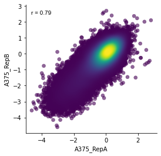
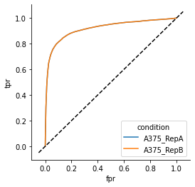

# poola
> Python package for pooled screen analysis


## Install

Install from github for the latest development release:

`pip install git+git://github.com/gpp-rnd/poola.git#egg=poola`

Or install the most recent distribution from PyPi:

[](https://badge.fury.io/py/poola)

`pip install poola`

## How to use

Additional packages required for this tutorial can be install using `pip install -r requirements.txt`

```
from poola import core as pool
import pandas as pd
import seaborn as sns
import gpplot
import matplotlib.pyplot as plt
```

To demonstrate the functionality of this module we'll use read counts from [Sanson et al. 2018](https://doi.org/10.1038/s41467-018-07901-8).

```
supp_reads = 'https://static-content.springer.com/esm/art%3A10.1038%2Fs41467-018-07901-8/MediaObjects/41467_2018_7901_MOESM4_ESM.xlsx'
read_counts = pd.read_excel(supp_reads,
                            sheet_name = 'A375_orig_tracr raw reads', 
                            header = None,
                            skiprows = 3, 
                            names = ['sgRNA Sequence', 'pDNA', 'A375_RepA', 'A375_RepB'], 
                            engine='openpyxl')
guide_annotations = pd.read_excel(supp_reads,
                                  sheet_name='sgRNA annotations', 
                                  engine='openpyxl')
```

The input data has three columns with read counts and one column with sgRNA annotations

```
read_counts.head()
```


<div>
<style scoped>
    .dataframe tbody tr th:only-of-type {
        vertical-align: middle;
    }

    .dataframe tbody tr th {
        vertical-align: top;
    }

    .dataframe thead th {
        text-align: right;
    }
</style>
<table border="1" class="dataframe">
  <thead>
    <tr style="text-align: right;">
      <th></th>
      <th>sgRNA Sequence</th>
      <th>pDNA</th>
      <th>A375_RepA</th>
      <th>A375_RepB</th>
    </tr>
  </thead>
  <tbody>
    <tr>
      <th>0</th>
      <td>AAAAAAAATCCGGACAATGG</td>
      <td>522</td>
      <td>729</td>
      <td>774</td>
    </tr>
    <tr>
      <th>1</th>
      <td>AAAAAAAGGATGGTGATCAA</td>
      <td>511</td>
      <td>1484</td>
      <td>1393</td>
    </tr>
    <tr>
      <th>2</th>
      <td>AAAAAAATGACATTACTGCA</td>
      <td>467</td>
      <td>375</td>
      <td>603</td>
    </tr>
    <tr>
      <th>3</th>
      <td>AAAAAAATGTCAGTCGAGTG</td>
      <td>200</td>
      <td>737</td>
      <td>506</td>
    </tr>
    <tr>
      <th>4</th>
      <td>AAAAAACACAAGCAAGACCG</td>
      <td>286</td>
      <td>672</td>
      <td>352</td>
    </tr>
  </tbody>
</table>
</div>


```
lognorms = pool.lognorm_columns(reads_df=read_counts, columns=['pDNA', 'A375_RepA', 'A375_RepB'])
filtered_lognorms = pool.filter_pdna(lognorm_df=lognorms, pdna_cols=['pDNA'], z_low=-3)
print('Filtered ' + str(lognorms.shape[0] - filtered_lognorms.shape[0]) + ' columns due to low pDNA abundance')
```

    Filtered 576 columns due to low pDNA abundance


Note that the column names for the lognorms remain the same

```
lognorms.head()
```


<div>
<style scoped>
    .dataframe tbody tr th:only-of-type {
        vertical-align: middle;
    }

    .dataframe tbody tr th {
        vertical-align: top;
    }

    .dataframe thead th {
        text-align: right;
    }
</style>
<table border="1" class="dataframe">
  <thead>
    <tr style="text-align: right;">
      <th></th>
      <th>sgRNA Sequence</th>
      <th>pDNA</th>
      <th>A375_RepA</th>
      <th>A375_RepB</th>
    </tr>
  </thead>
  <tbody>
    <tr>
      <th>0</th>
      <td>AAAAAAAATCCGGACAATGG</td>
      <td>4.192756</td>
      <td>3.373924</td>
      <td>3.521755</td>
    </tr>
    <tr>
      <th>1</th>
      <td>AAAAAAAGGATGGTGATCAA</td>
      <td>4.163726</td>
      <td>4.326828</td>
      <td>4.312620</td>
    </tr>
    <tr>
      <th>2</th>
      <td>AAAAAAATGACATTACTGCA</td>
      <td>4.041390</td>
      <td>2.540624</td>
      <td>3.196767</td>
    </tr>
    <tr>
      <th>3</th>
      <td>AAAAAAATGTCAGTCGAGTG</td>
      <td>2.930437</td>
      <td>3.388159</td>
      <td>2.973599</td>
    </tr>
    <tr>
      <th>4</th>
      <td>AAAAAACACAAGCAAGACCG</td>
      <td>3.388394</td>
      <td>3.268222</td>
      <td>2.528233</td>
    </tr>
  </tbody>
</table>
</div>


```
lfc_df = pool.calculate_lfcs(lognorm_df=filtered_lognorms, ref_col='pDNA', target_cols=['A375_RepA', 'A375_RepB'])
```

We drop the pDNA column after calculating log-fold changes

```
lfc_df.head()
```


<div>
<style scoped>
    .dataframe tbody tr th:only-of-type {
        vertical-align: middle;
    }

    .dataframe tbody tr th {
        vertical-align: top;
    }

    .dataframe thead th {
        text-align: right;
    }
</style>
<table border="1" class="dataframe">
  <thead>
    <tr style="text-align: right;">
      <th></th>
      <th>sgRNA Sequence</th>
      <th>A375_RepA</th>
      <th>A375_RepB</th>
    </tr>
  </thead>
  <tbody>
    <tr>
      <th>0</th>
      <td>AAAAAAAATCCGGACAATGG</td>
      <td>-0.818831</td>
      <td>-0.671000</td>
    </tr>
    <tr>
      <th>1</th>
      <td>AAAAAAAGGATGGTGATCAA</td>
      <td>0.163102</td>
      <td>0.148894</td>
    </tr>
    <tr>
      <th>2</th>
      <td>AAAAAAATGACATTACTGCA</td>
      <td>-1.500766</td>
      <td>-0.844622</td>
    </tr>
    <tr>
      <th>3</th>
      <td>AAAAAAATGTCAGTCGAGTG</td>
      <td>0.457721</td>
      <td>0.043161</td>
    </tr>
    <tr>
      <th>4</th>
      <td>AAAAAACACAAGCAAGACCG</td>
      <td>-0.120172</td>
      <td>-0.860161</td>
    </tr>
  </tbody>
</table>
</div>


Since we only have two conditions it's easy to visualize replicates as a point densityplot using [gpplot](https://github.com/gpp-rnd/gpplot)

```
plt.subplots(figsize=(4,4))
gpplot.point_densityplot(data=lfc_df, x='A375_RepA', y='A375_RepB')
gpplot.add_correlation(data=lfc_df, x='A375_RepA', y='A375_RepB')
sns.despine()
```


    

    


Since we see a strong correlation, we'll average the log-fold change of each sgRNA across replicates

```
avg_replicate_lfc_df = pool.average_replicate_lfcs(lfcs=lfc_df, guide_col='sgRNA Sequence', condition_indices=[0],
                                                   sep='_')
```

After averaging log-fold changes our dataframe is melted, so the condition column specifies the experimental condition (A375 here) and the n_obs specifies the number of replicates

```
avg_replicate_lfc_df.head()
```


<div>
<style scoped>
    .dataframe tbody tr th:only-of-type {
        vertical-align: middle;
    }

    .dataframe tbody tr th {
        vertical-align: top;
    }

    .dataframe thead th {
        text-align: right;
    }
</style>
<table border="1" class="dataframe">
  <thead>
    <tr style="text-align: right;">
      <th></th>
      <th>sgRNA Sequence</th>
      <th>condition</th>
      <th>avg_lfc</th>
      <th>n_obs</th>
    </tr>
  </thead>
  <tbody>
    <tr>
      <th>0</th>
      <td>AAAAAAAATCCGGACAATGG</td>
      <td>A375</td>
      <td>-0.744916</td>
      <td>2</td>
    </tr>
    <tr>
      <th>1</th>
      <td>AAAAAAAGGATGGTGATCAA</td>
      <td>A375</td>
      <td>0.155998</td>
      <td>2</td>
    </tr>
    <tr>
      <th>2</th>
      <td>AAAAAAATGACATTACTGCA</td>
      <td>A375</td>
      <td>-1.172694</td>
      <td>2</td>
    </tr>
    <tr>
      <th>3</th>
      <td>AAAAAAATGTCAGTCGAGTG</td>
      <td>A375</td>
      <td>0.250441</td>
      <td>2</td>
    </tr>
    <tr>
      <th>4</th>
      <td>AAAAAACACAAGCAAGACCG</td>
      <td>A375</td>
      <td>-0.490166</td>
      <td>2</td>
    </tr>
  </tbody>
</table>
</div>


It's sometimes helpful to group controls into pseudo-genes so they're easier to compare with target genes. Our annotation file maps from sgRNA sequences to gene symbols

```
remapped_annotations = pool.group_pseudogenes(annotations=guide_annotations, pseudogene_size=4, 
                                              gene_col='Annotated Gene Symbol', 
                                              control_regex=['NO_CURRENT'])
remapped_annotations.head()
```


<div>
<style scoped>
    .dataframe tbody tr th:only-of-type {
        vertical-align: middle;
    }

    .dataframe tbody tr th {
        vertical-align: top;
    }

    .dataframe thead th {
        text-align: right;
    }
</style>
<table border="1" class="dataframe">
  <thead>
    <tr style="text-align: right;">
      <th></th>
      <th>sgRNA Sequence</th>
      <th>Annotated Gene Symbol</th>
      <th>Annotated Gene ID</th>
    </tr>
  </thead>
  <tbody>
    <tr>
      <th>0</th>
      <td>AAAAAAAATCCGGACAATGG</td>
      <td>SLC25A24</td>
      <td>29957</td>
    </tr>
    <tr>
      <th>1</th>
      <td>AAAAAAAGGATGGTGATCAA</td>
      <td>FASTKD3</td>
      <td>79072</td>
    </tr>
    <tr>
      <th>2</th>
      <td>AAAAAAATGACATTACTGCA</td>
      <td>BCAS2</td>
      <td>10286</td>
    </tr>
    <tr>
      <th>3</th>
      <td>AAAAAAATGTCAGTCGAGTG</td>
      <td>GPR18</td>
      <td>2841</td>
    </tr>
    <tr>
      <th>4</th>
      <td>AAAAAACACAAGCAAGACCG</td>
      <td>ZNF470</td>
      <td>388566</td>
    </tr>
  </tbody>
</table>
</div>


We provide two methods for scaling log-fold change values to controls:

1. Z-score from a set of negative controls
2. Scale scores between a set of negative and positive controls

For both scoring methods, you can input either a regex or a list of genes to define control sets

For our set of negative controls, we'll use [nonessential](https://doi.org/10.15252/msb.20145216) genes

```
nonessential_genes = (pd.read_table('https://raw.githubusercontent.com/gpp-rnd/genesets/master/human/non-essential-genes-Hart2014.txt',
                                    names=['gene'])
                      .gene)
annot_guide_lfcs = pool.annotate_guide_lfcs(avg_replicate_lfc_df, remapped_annotations, 'Annotated Gene Symbol',
                                            merge_on='sgRNA Sequence', z_score_neg_ctls=True,
                                            z_score_neg_ctl_genes=nonessential_genes)
annot_guide_lfcs.head()
```


<div>
<style scoped>
    .dataframe tbody tr th:only-of-type {
        vertical-align: middle;
    }

    .dataframe tbody tr th {
        vertical-align: top;
    }

    .dataframe thead th {
        text-align: right;
    }
</style>
<table border="1" class="dataframe">
  <thead>
    <tr style="text-align: right;">
      <th></th>
      <th>sgRNA Sequence</th>
      <th>condition</th>
      <th>avg_lfc</th>
      <th>n_obs</th>
      <th>Annotated Gene Symbol</th>
      <th>Annotated Gene ID</th>
      <th>z_scored_avg_lfc</th>
    </tr>
  </thead>
  <tbody>
    <tr>
      <th>0</th>
      <td>AAAAAAAATCCGGACAATGG</td>
      <td>A375</td>
      <td>-0.744916</td>
      <td>2</td>
      <td>SLC25A24</td>
      <td>29957</td>
      <td>-1.651921</td>
    </tr>
    <tr>
      <th>1</th>
      <td>AAAAAAAGGATGGTGATCAA</td>
      <td>A375</td>
      <td>0.155998</td>
      <td>2</td>
      <td>FASTKD3</td>
      <td>79072</td>
      <td>0.166585</td>
    </tr>
    <tr>
      <th>2</th>
      <td>AAAAAAATGACATTACTGCA</td>
      <td>A375</td>
      <td>-1.172694</td>
      <td>2</td>
      <td>BCAS2</td>
      <td>10286</td>
      <td>-2.515396</td>
    </tr>
    <tr>
      <th>3</th>
      <td>AAAAAAATGTCAGTCGAGTG</td>
      <td>A375</td>
      <td>0.250441</td>
      <td>2</td>
      <td>GPR18</td>
      <td>2841</td>
      <td>0.357219</td>
    </tr>
    <tr>
      <th>4</th>
      <td>AAAAAACACAAGCAAGACCG</td>
      <td>A375</td>
      <td>-0.490166</td>
      <td>2</td>
      <td>ZNF470</td>
      <td>388566</td>
      <td>-1.137705</td>
    </tr>
  </tbody>
</table>
</div>


To aggregate scores at the gene level, we specify columns to average, and columns to z-score.
From our z-scores we calculate a p-value and FDR using the [Benjamini-Hochberg procedure](http://www.biostathandbook.com/multiplecomparisons.html)


```
gene_lfcs = pool.aggregate_gene_lfcs(annot_guide_lfcs, 'Annotated Gene Symbol',
                                     average_cols=['avg_lfc'],
                                     zscore_cols=['z_scored_avg_lfc'])
gene_lfcs.head()
```


<div>
<style scoped>
    .dataframe tbody tr th:only-of-type {
        vertical-align: middle;
    }

    .dataframe tbody tr th {
        vertical-align: top;
    }

    .dataframe thead th {
        text-align: right;
    }
</style>
<table border="1" class="dataframe">
  <thead>
    <tr style="text-align: right;">
      <th></th>
      <th>condition</th>
      <th>Annotated Gene Symbol</th>
      <th>n_guides</th>
      <th>avg_lfc</th>
      <th>z_scored_avg_lfc</th>
      <th>z_scored_avg_lfc_p_value</th>
      <th>z_scored_avg_lfc_fdr</th>
    </tr>
  </thead>
  <tbody>
    <tr>
      <th>0</th>
      <td>A375</td>
      <td>A1BG</td>
      <td>3</td>
      <td>-0.084621</td>
      <td>-0.552711</td>
      <td>0.580461</td>
      <td>0.872833</td>
    </tr>
    <tr>
      <th>1</th>
      <td>A375</td>
      <td>A1CF</td>
      <td>4</td>
      <td>0.500314</td>
      <td>1.723181</td>
      <td>0.084856</td>
      <td>0.338055</td>
    </tr>
    <tr>
      <th>2</th>
      <td>A375</td>
      <td>A2M</td>
      <td>4</td>
      <td>0.288629</td>
      <td>0.868604</td>
      <td>0.385064</td>
      <td>0.759829</td>
    </tr>
    <tr>
      <th>3</th>
      <td>A375</td>
      <td>A2ML1</td>
      <td>4</td>
      <td>-0.481786</td>
      <td>-2.241580</td>
      <td>0.024989</td>
      <td>0.132164</td>
    </tr>
    <tr>
      <th>4</th>
      <td>A375</td>
      <td>A3GALT2</td>
      <td>4</td>
      <td>0.059362</td>
      <td>-0.056952</td>
      <td>0.954583</td>
      <td>0.990693</td>
    </tr>
  </tbody>
</table>
</div>


Finally, to evaluate the quality this screen, we'll calculate the ROC-AUC between [essential](https://doi.org/10.1016/j.cell.2015.11.015) and [nonessential](https://doi.org/10.15252/msb.20145216) genes for each condition

```
essential_genes = (pd.read_table('https://raw.githubusercontent.com/gpp-rnd/genesets/master/human/essential-genes-Hart2015.txt', 
                                 names=['gene'])
                   .gene)
roc_aucs, roc_df = pool.get_roc_aucs(lfcs=gene_lfcs, tp_genes=essential_genes, fp_genes=nonessential_genes, gene_col='Annotated Gene Symbol',
                                     condition_col='condition', score_col='avg_lfc')
print('ROC-AUC: ' + str(round(roc_aucs['ROC-AUC'].values[0], 3)))
```

    ROC-AUC: 0.976


Note that we can also use this function to calculate roc-aucs at the guide level

```
annotated_guide_lfcs = lfc_df.merge(guide_annotations, how='inner', on='sgRNA Sequence')
roc_aucs, roc_df = pool.get_roc_aucs(lfcs=annotated_guide_lfcs, tp_genes=essential_genes, fp_genes=nonessential_genes, gene_col='Annotated Gene Symbol',
                                     condition_list=['A375_RepA', 'A375_RepB'])
roc_aucs
```


<div>
<style scoped>
    .dataframe tbody tr th:only-of-type {
        vertical-align: middle;
    }

    .dataframe tbody tr th {
        vertical-align: top;
    }

    .dataframe thead th {
        text-align: right;
    }
</style>
<table border="1" class="dataframe">
  <thead>
    <tr style="text-align: right;">
      <th></th>
      <th>condition</th>
      <th>ROC-AUC</th>
    </tr>
  </thead>
  <tbody>
    <tr>
      <th>0</th>
      <td>A375_RepA</td>
      <td>0.918505</td>
    </tr>
    <tr>
      <th>1</th>
      <td>A375_RepB</td>
      <td>0.917600</td>
    </tr>
  </tbody>
</table>
</div>


And plot ROC curves from the `roc_df`


```
plt.subplots(figsize=(4,4))
sns.lineplot(data=roc_df, x='fpr', y='tpr', hue='condition', ci=None)
gpplot.add_xy_line()
sns.despine()
```


    

    

